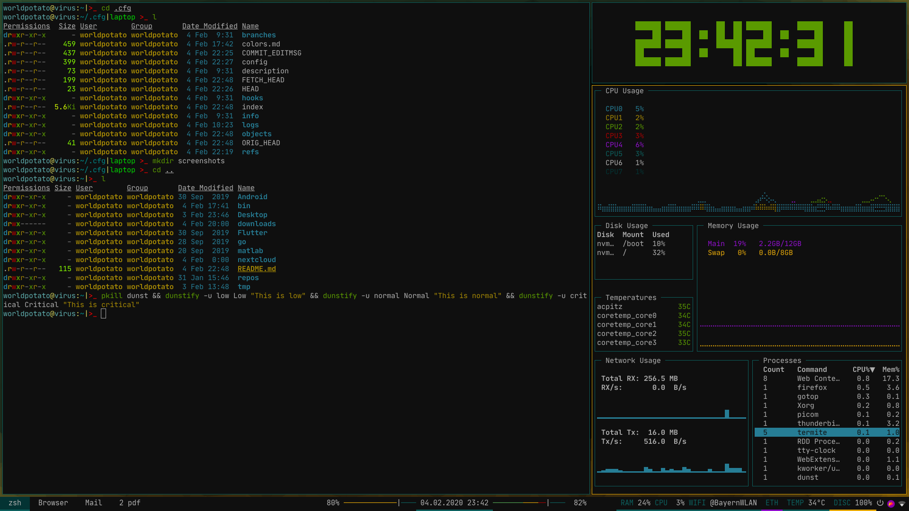
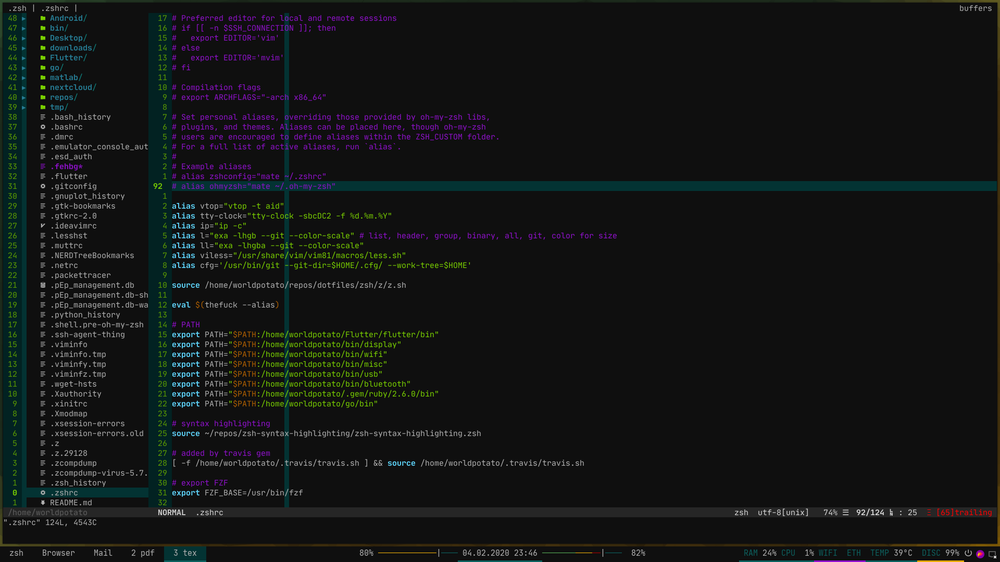

These are my dotfiles. I'm nothing without my dotfiles.

# Branch 

## Laptop

The branch for my private laptop.

# Screenshots for private laptop

## Empty Workspace

## zsh Workspace with exa

an `ll` and `l` alias is set for exa with a lot options

## vim

## zathura, ranger and dunst for notifications

